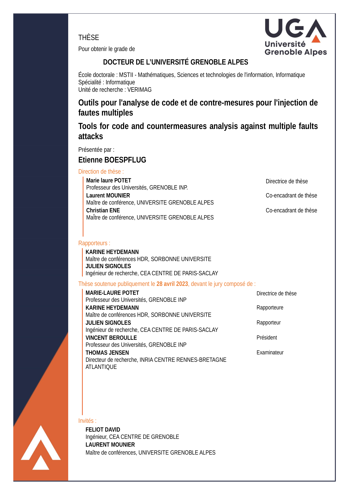

# Tools for code and countermeasures analysis against multiple faults attacks - PhD Thesis Manuscript (french)

  

This repository contains the LaTeX source code of my PhD Thesis manuscript (in french).
The PDF file can be found [here](phd-thesis-manuscript-fr.pdf).
This PhD thesis was publicly defended at (VERIMAG)[https://www-verimag.imag.fr/?lang=en]  laboratory on August 28, 2023. The defense repository will be available [here](todo). The thesis defense jury included the following members:
 - Vincent Beroulle
 - Karine Heydemann
 - Thomas Jensen
 - Marie-Laure Potet
 - Julien Signoles
 - David Féliot (invited)
 - Laurent Mounier (invited)

## Information

 - ***title***: "Outils pour l'analyse de code et de contre-mesures pour l'injection de fautes multiples"
 - ***title (english)***: "Tools for code and countermeasures analysis against multiple faults
attacks"
 - ***keywords***: *Code analysis*, *Fault injection*, *Multiple faults*, *Software countermeasures*, *Countermeasure evaluation*, *Lazart*
 - ***abstract (english)***: Active attackers are able to modify the behavior of the program during its execution. In particular, fault injection attacks, which originally emerged as a method of testing against accidental hardware faults, are a powerful attack vector in which the attacker can inject faults during execution using physical techniques such as laser beams [Roscian 2013, Colombier 2019], or voltage [Bar-El 2006] or frequency glitches [Agoyan 2010, Yuce 2018]. 
 More recently, software fault injection methods have been proposed [Park 2014]. This thesis focuses on analysing programs in the context of fault injection attacks, and more particularly multiple faults, which implies that the attacker is able to combine several faults to complete an attack. Combined attacks make more difficult the evaluation of the robustness of programs by tools because of the combinatorial explosion of the execution paths due to faults.
This manuscript presents the different contributions of this thesis. First, the robustness
analysis tool Lazart has been developped during this thesis, aiming at helping the search of
attacks on software in a multi-fault contex. The evaluation of protections against this type
of attacks has also been an important topic of this thesis and contribution are presented
to assist the placement of software countermeasures. Finally, the placement tools used in
the literature are often based on a trial-and-error approach that is not adapted to multiple
fault contexts, and they rarely address the verification that these protections are effectively
useful in the program. A methodology to optimise the placementof countermeasures has
been developed, able to determine which portions of the protections in a program can be
removed, while maintaining the same level of security.

## Usage

LaTeX main file is [manuscrit.tex](src/manuscrit.tex) and all file (source code, images...) are located in the `src/` folder. 